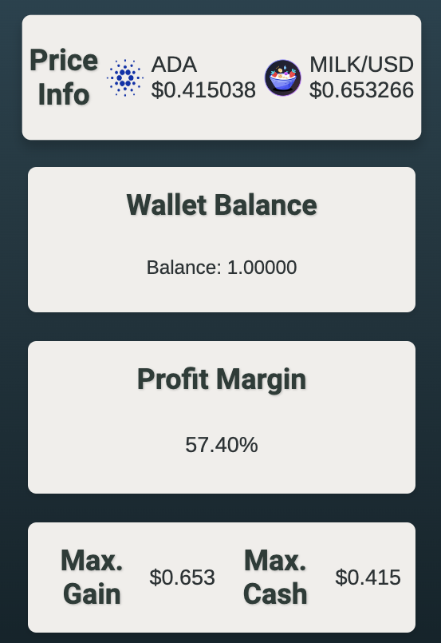

<h1 align="center">MVOUCHER Profit Tracker</h1>
<h2 align="center"></h2>
<h2 align="center"></h2>

## Description and Usage
MVoucher Profit Tracker is a Python (Flask) powered web dashboard that calculates the profit margin when exercising an [$MVOUCHER](https://cardanoscan.io/token/a2936e00439913f1ac105c29883c013322360247c409343028b831be4d564f5543484552) call option into a [$MILK](https://cardanoscan.io/token/afbe91c0b44b3040e360057bf8354ead8c49c4979ae6ab7c4fbdc9eb4d494c4b7632) token within the MuesliSwap protocol/Cardano blockchain. 

## System Requirements
You will need the following services to utilize MVoucher Profit Tracker:

### Blockfrost Account
A Blockfrost API key is required to retrieve data from the Cardano blockain. and can be obtained after registration via the following link:
 - https://blockfrost.dev/overview/getting-started

### Coingecko API
MVoucher Profit Tracker uses the (free) public Coingecko API for aggregate price info: 
- https://www.coingecko.com/en/api/pricing

## Dependencies
To install the necessary dependencies, you can use the included `requirements.txt` file:

```sh
pip install -r requirements.txt
```

```sh
Flask==2.1.1
Flask-Cors==3.0.10
python-dotenv==0.20.0
requests==2.27.1
```

## Instructions

1. Ensure Python3 is installed. You can download it from python.org.
2. Open a new Terminal/Command Prompt window, clone project repo:

```sh
git clone https://github.com/brandontownes/MVOUCHER-Profit-Tracker
```

3. Replace environment variables in '.env_template' with the your own Blockfrost API key and ADA wallet address, then Save the new file as '.env' in the project directory (may need to enable 'view hidden files' first):

```bash
BLOCKFROST_PROJECT_ID=[BLOCKFROST_PROJECT_ID]
ADA_WALLET_ADDRESS=[ADA_WALLET_ADDRESS] # should contain at least 1 MVOUCHER token
```

4. Start the web server:

```bash
cd </projcet_directory>
python3 main.py
 * Serving Flask app 'app'
 * Debug mode: off
WARNING: This is a development server. Do not use it in a production deployment. Use a production WSGI server instead.
 * Running on all addresses (0.0.0.0)
 * Running on http://127.0.0.1:8080
Press CTRL+C to quit
```
5. Load one of the local addresses into a web browser to start the dashbaord. 